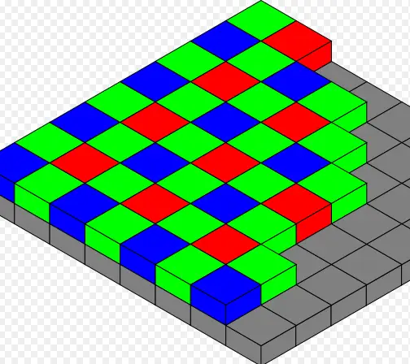
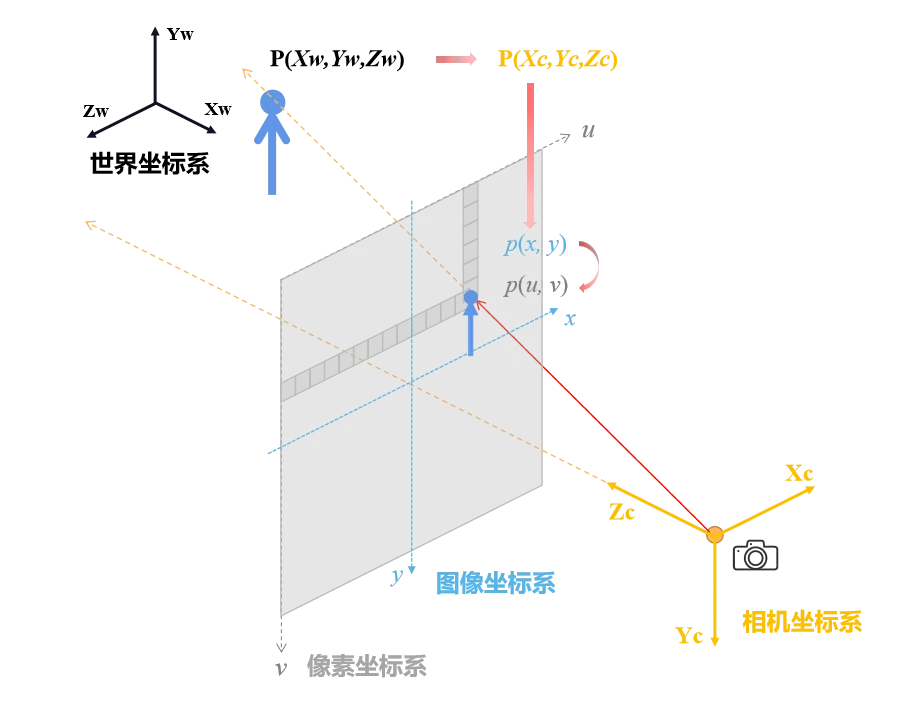
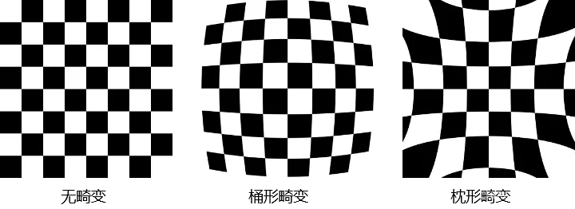
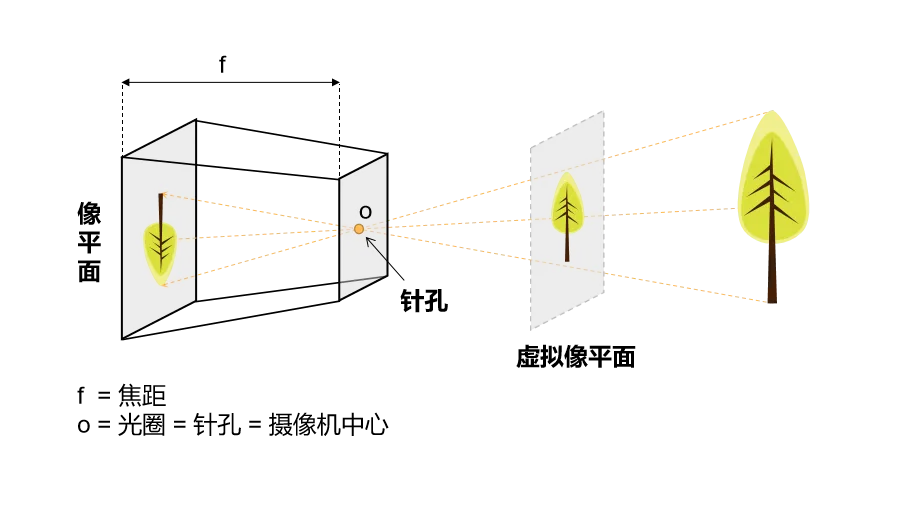

# 相机模型和计算机图像处理

## 相机成像原理
相机成像原理是指相机如何将三维世界中的光线转换为二维图像的过程。这个过程可以分为几个步骤：
1. **光线入射**：光线从三维空间中的物体表面入射到相机的镜头上。
2. **光线折射**：光线通过相机镜头的玻璃材料时，会发生折射，改变光线的传播方向。
3. **光线聚焦**：相机镜头将入射的光线聚焦到图像传感器上，形成一个清晰的图像。
4. **图像采样**：图像传感器将聚焦的光线转换为电信号，并进行采样，形成数字图像。
5. **图像处理**：数字图像经过处理后，形成最终的图像输出。

## 相机传感器
相机传感器是相机中用于捕捉光线并将其转换为电信号的组件。相机传感器通常分为两类：CCD（电荷耦合器件）和CMOS（互补金属氧化物半导体）。

图像的明暗程度通常由传感器的曝光时间和光圈大小决定。曝光时间越长，传感器接收到的光线越多，图像就越亮；光圈越大，传感器接收到的光线也越多，图像同样会变亮。
图像的颜色通常由传感器的白平衡设置和颜色滤光片决定。白平衡设置用于调整图像的色温，使得图像中的白色物体看起来是白色的；颜色滤光片则用于将光线分解为不同颜色的成分，以便进行后续处理。
拜耳滤色器是相机传感器中常用的颜色滤光片阵列，用于将光线分解为红、绿、蓝三种颜色。拜耳滤色器的排列方式通常是2x2的格子，其中包含两个绿色像素、一个红色像素和一个蓝色像素。这种排列方式使得相机在拍摄时能够更好地捕捉到人眼对绿色的敏感度。

## 相机坐标系
相机坐标系是描述相机成像过程中的一个重要概念。相机坐标系通常分为两种：图像坐标系和世界坐标系。
- **图像坐标系**：描述图像中每个像素的位置，通常以左上角为原点，x轴向右，y轴向下。
- **世界坐标系**：描述三维空间中的点的位置，通常以相机的光心为原点，x轴向右，y轴向下，z轴垂直于图像平面。
- **相机坐标系**：描述相机在三维空间中的位置和朝向，通常以相机的光心为原点，x轴向右，y轴向下，z轴垂直于图像平面。
相机坐标系的建立通常需要进行相机标定，以确定相机的内外参数。相机坐标系的建立是计算机视觉和图像处理中的一个重要步骤，它为后续的图像处理和分析提供了基础。

相机虚拟像平面是一个假想的平面，用于描述相机成像过程中的光线传播。虚拟像平面通常与相机的图像传感器平行，并位于相机的光心前方。虚拟像平面的建立是为了方便描述相机成像过程中的几何关系。

## 相机参数
相机参数是描述相机成像过程的关键因素。相机参数通常分为内参数和外参数。
- **内参数**：描述相机内部特性，如焦距、主点位置和畸变系数等。
- **外参数**：描述相机在三维空间中的位置和朝向，如旋转矩阵和平移向量等。
内参数和外参数共同决定了相机的成像过程。
内参数和外参数的标定是相机成像过程中的重要步骤。相机标定的目的是确定相机的内外参数，以便在图像处理中进行准确的几何变换。

### 内参数
内参数是描述相机内部特性的参数。内参数通常包括：
- **焦距**：相机镜头的焦距，决定了相机的视场角和成像大小。
- **主点位置**：图像传感器上的主点位置，通常位于图像中心。
- **畸变系数**：描述相机镜头的畸变特性，如径向畸变和切向畸变等。
- **像素大小**：图像传感器上每个像素的大小，通常以毫米为单位。
- **传感器尺寸**：图像传感器的物理尺寸，通常以毫米为单位。
- **传感器分辨率**：图像传感器的分辨率，通常以像素为单位。

常见的内参矩阵形式为：
```
K = | fx  0   cx |
    | 0   fy  cy |
    | 0   0   1  |
```
其中，`fx`和`fy`分别表示水平方向和垂直方向的焦距，`cx`和`cy`分别表示主点在图像平面上的坐标。


### 外参数
外参数是描述相机在三维空间中的位置和朝向的参数。外参数通常包括：
- **旋转矩阵**：描述相机的旋转状态，通常用一个3x3的矩阵表示。
- **平移向量**：描述相机在三维空间中的位置，通常用一个3x1的向量表示。

外参数通常用一个4x4的变换矩阵表示，形式如下：
```
T = | R  t |
    | 0  1 |
```
其中，`R`是旋转矩阵，`t`是平移向量。

### 畸变系数
畸变系数是描述相机镜头畸变特性的参数。畸变通常分为两类：径向畸变和切向畸变。
- **径向畸变**：描述光线在通过镜头时的径向偏移，通常用三个系数`k1`、`k2`和`k3`表示。
- **切向畸变**：描述光线在通过镜头时的切向偏移，通常用两个系数`p1`和`p2`表示。
<br/>



径向畸变和切向畸变的数学模型通常表示为：
```
x' = x(1 + k1*r^2 + k2*r^4 + k3*r^6) + 2*p1*x*y + p2*(r^2 + 2*x^2)
y' = y(1 + k1*r^2 + k2*r^4 + k3*r^6) + p1*(r^2 + 2*y^2) + 2*p2*x*y
```

其中，`(x, y)`是原始图像坐标，`(x', y')`是畸变后的图像坐标，`r`是从主点到图像点的距离。

## 相机标定
相机标定是确定相机内外参数的过程。相机标定通常使用一些已知的三维点和对应的二维图像点进行计算。


## 相机模型
相机模型是计算机视觉和图像处理中的一个重要概念。它描述了如何将三维世界中的点映射到二维图像平面上。相机模型通常分为两类：针孔相机模型和透视相机模型。

### 针孔相机模型
针孔相机模型是最简单的相机模型，它假设光线通过一个小孔（针孔）进入相机。这个模型可以用来描述理想的相机成像过程。针孔相机模型的基本原理是：三维空间中的点通过针孔投影到图像平面上，形成一个二维图像。



### 透视相机模型
透视相机模型是针孔相机模型的扩展，它考虑了相机的内外参数。透视相机模型可以用来描述实际相机的成像过程，包括焦距、主点位置和畸变等因素。透视相机模型的基本原理是：三维空间中的点通过透视投影映射到图像平面上，形成一个二维图像。


透视相机模型的数学表示通常使用齐次坐标系。假设三维空间中的点为`P = (X, Y, Z)`，相机的内参数矩阵为`K`，外参数矩阵为`T`，则透视投影可以表示为：
```
P' = K * T * P
```

## 反投影和solvePnP

### 反投影
反投影是将二维图像点映射回三维空间的过程。反投影通常用于计算机视觉中的三维重建和相机定位等任务。反投影的基本原理是：根据相机的内外参数，将二维图像点映射到三维空间中的一条射线上。

反投影的数学表示通常使用齐次坐标系。假设二维图像点为`p = (u, v)`，相机的内参数矩阵为`K`，外参数矩阵为`T`，则反投影可以表示为：

1. **图像点到3D点的反投影过程：**
   
   假设相机拍摄的图像中的一个点 \( p = (u, v) \)，可以通过以下步骤进行反投影计算：

   - 将像素坐标转换为标准化的图像坐标：
     \[
     \begin{bmatrix} x_{norm} \\ y_{norm} \\ 1 \end{bmatrix} = K^{-1} \cdot \begin{bmatrix} u \\ v \\ 1 \end{bmatrix}
     \]
     这样得到的 \( (x_{norm}, y_{norm}) \) 就是图像坐标系中归一化后的坐标。

   - 反投影回到3D空间：通过假设某个深度 \( z \)（通常可以假设 \( z = 1 \) 或其他深度值），得到对应的3D点：
     \[
     \begin{bmatrix} X \\ Y \\ Z \end{bmatrix} = z \cdot \begin{bmatrix} x_{norm} \\ y_{norm} \\ 1 \end{bmatrix}
     \]
     这就是将图像平面上的2D点反投影到3D空间中的方法。

1. **外参的影响：**
   由于外参矩阵 \( [R | t] \) 描述了相机在世界坐标系中的位置和方向，它会影响反投影的结果。在进行反投影时，通常会通过相机的外参来转换回世界坐标系：

   \[
   \begin{bmatrix} X_{world} \\ Y_{world} \\ Z_{world} \end{bmatrix} = R \cdot \begin{bmatrix} X \\ Y \\ Z \end{bmatrix} + t
   \]

### solvePnP
pnp（Perspective-n-Point）是一个用于求解相机位姿的算法。它的基本思想是通过已知的三维点和对应的二维图像点，计算相机的外参数（旋转矩阵和平移向量）。pnp算法通常用于相机定位和三维重建等任务。
pnp算法的输入通常包括：
- 一组已知的三维点（世界坐标系中的点）。
- 一组对应的二维图像点（图像坐标系中的点）。
- 相机的内参数矩阵（焦距、主点位置等）。
pnp算法的输出通常包括：
- 相机的旋转矩阵（描述相机的朝向）。
- 相机的平移向量（描述相机的位置）。

pnp算法的实现通常使用一些优化方法，如最小二乘法或非线性优化等。常见的pnp算法包括EPnP、UPnP和RPnP等。
标准的pnp算法通常使用以下步骤进行计算：
1. **输入数据准备**：准备已知的三维点和对应的二维图像点，以及相机的内参数矩阵。
2. **初始估计**：使用一些初始估计算法（如EPnP）计算相机的初始位姿。
3. **优化**：使用非线性优化方法（如Levenberg-Marquardt算法）对初始估计进行优化，以获得更精确的相机位姿。
4. **输出结果**：输出优化后的相机旋转矩阵和平移向量。
pnp算法的实现通常使用一些开源库，如OpenCV等。OpenCV提供了一个名为`solvePnP`的函数，用于实现pnp算法。该函数的输入包括已知的三维点、对应的二维图像点和相机的内参数矩阵，输出包括相机的旋转向量和平移向量。
`solvePnP`函数的使用示例：
```python
import cv2
import numpy as np
# 已知的三维点（世界坐标系中的点
object_points = np.array([[0, 0, 0], [1, 0, 0], [0, 1, 0], [1, 1, 0]], dtype=np.float32)
# 对应的二维图像点（图像坐标系中的点）
image_points = np.array([[100, 200], [200, 200], [100, 300], [200, 300]], dtype=np.float32)
# 相机的内参数矩阵
camera_matrix = np.array([[1000, 0, 320], [0, 1000, 240], [0, 0, 1]], dtype=np.float32)
# 畸变系数
dist_coeffs = np.array([0, 0, 0, 0], dtype=np.float32)
# 计算相机的旋转向量和平移向量
success, rvec, tvec = cv2.solvePnP(object_points, image_points, camera_matrix, dist_coeffs)
# 输出结果
print("旋转向量：", rvec)
print("平移向量：", tvec)
```

[link to opencv web wiki](https://docs.opencv.org/3.4/d5/d1f/calib3d_solvePnP.html)


