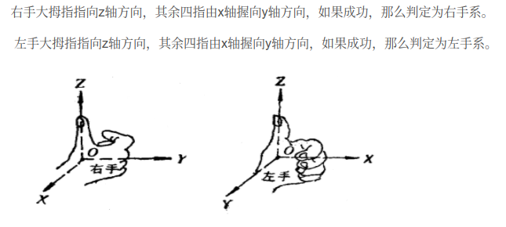
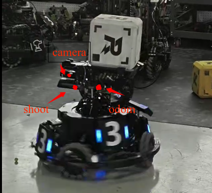

# 视觉第三课（第一部分）：坐标系转换😉

author：[Cinjay Jiang](https://github.com/knot41)

date：2025/4/13

---

## 一、什么是坐标系？🤔

例子：高中时候的立体几何问题。

三维空间下，坐标系 = 原点 + 三个轴（x、y、z）。

根据建系方式的不同可以分为**左手系**和**右手系**。

### 比赛机器人中常见的坐标系🫣

- `world`：世界坐标系
- `camera`：相机坐标系
- `odom`：底盘坐标系
- `shoot`：射击坐标系

每个零件都可以认为有自己的坐标系，彼此之间需要**变换**才能统一认识世界。

---

## 二、坐标系怎么变换？🤔

坐标系变换 = 把一个点/物体从一个坐标系转换到另一个坐标系的描述方式。

本质：换个参考点来看世界

先约定一个大前提，在一个坐标系中点的坐标~~只有位置~~的描述，实际上描述应该包含位置和姿态。🤪

我们假设：
- 有两个坐标系：A 和 B
- 一个点 $P_b$ 在 B 坐标系下的坐标是（x，y，z）
- 我们想求这个点在 A 坐标系下的表示，也就是 $p_a$。

我们需要两个信息：

1. **B 相对于 A 的位置（平移）** → 一个向量 $\mathbf{t}^B_A$
2. **B 相对于 A 的朝向（旋转）** → 一个旋转矩阵 $\mathbf{R}^B_A$

那么公式就是：

$$
\mathbf{p}_A = \mathbf{R}^B_A \cdot \mathbf{p}_B + \mathbf{t}^B_A
$$

这就是一个经典的坐标变换(可惜只有位置)！

### 举个例子讲清楚 🌰

假设：

- B 坐标系是 A 坐标系往右平移了 1 米，并绕 Z 轴旋转了 90 度
- 点 $\mathbf{p}_B = \begin{bmatrix} 1 \\ 0 \\ 0 \end{bmatrix}$

那：

- $\mathbf{t}^B_A = \begin{bmatrix} 1 \\ 0 \\ 0 \end{bmatrix}$  
- $\mathbf{R}^B_A = \begin{bmatrix} 0 & -1 & 0 \\ 1 & 0 & 0 \\ 0 & 0 & 1 \end{bmatrix}$

计算：

$$
\begin{aligned}
\mathbf{p}_A &= \mathbf{R}^B_A \cdot \mathbf{p}_B + \mathbf{t}^B_A \\
&= \begin{bmatrix} 0 & -1 & 0 \\ 1 & 0 & 0 \\ 0 & 0 & 1 \end{bmatrix}
\begin{bmatrix} 1 \\ 0 \\ 0 \end{bmatrix}
+ \begin{bmatrix} 1 \\ 0 \\ 0 \end{bmatrix} \\
&= \begin{bmatrix} 0 \\ 1 \\ 0 \end{bmatrix}
+ \begin{bmatrix} 1 \\ 0 \\ 0 \end{bmatrix}
= \begin{bmatrix} 1 \\ 1 \\ 0 \end{bmatrix}
\end{aligned}
$$

也就是说：同一个点，在 B 里是 (1, 0, 0)，但在 A 里是 (1, 1, 0)。

> *Tip*：Z 轴均垂直于屏幕朝向自己。
### 更近一步🧑‍🔧

为了方便平移+旋转一起表述，我们把点扩成四维（加个1）：

$$
\mathbf{P}_B^{(h)} = \begin{bmatrix} x \\ y \\ z \\ 1 \end{bmatrix}
$$

齐次变换矩阵 $\mathbf{T}_A^B$ 是：

$$
\mathbf{T}_A^B = \begin{bmatrix} \mathbf{R}_{3 \times 3} & \mathbf{t}_{3 \times 1} \\ \mathbf{0}_{1 \times 3} & 1 \end{bmatrix}
$$

那么变换就写成一行：

$$
\mathbf{P}_A^{(h)} = \mathbf{T}_A^B \cdot \mathbf{P}_B^{(h)}
$$

这就是最标准的坐标转换操作(可惜只有位置)！

牢记口诀：**坐标系A下的齐次位置坐标等于坐标系B下的齐次位置坐标左乘上B相对于A的齐次变换矩阵**。🥰

---

## 三、什么是位姿？🤔

**位姿** 就是 **位置** 和 **姿态**。

位置就是三维坐标，而姿态是描述一个物体相对于参考坐标系的朝向的方式。

姿态的表示方法有很多，一般可以用四元数、旋转矩阵、旋转向量和欧拉角等来表示，这几种表示方法都各有优缺点。

---

## 四、旋转矩阵是啥？🤔

在三维空间中，旋转矩阵用于描述一个物体或坐标系如何相对于另一个坐标系旋转。它是一个 3×3 的正交矩阵，用于表示姿态。

旋转矩阵满足以下性质：
- 行向量（或列向量）两两正交
- 每个向量长度为1
- 行列式为 +1
- $R^{-1} = R^T$（即转置等于逆）

以下列出了绕 $x$ 轴、$y$ 轴、$z$ 轴旋转的标准旋转矩阵：

> 正方向：右手握住轴，大拇指指向正方向，其余四指方向为正转角方向。

### 绕 X 轴旋转 $\theta$

$$
R_x(\theta) =
\begin{bmatrix}
1 & 0 & 0 \\
0 & \cos\theta & -\sin\theta \\
0 & \sin\theta & \cos\theta
\end{bmatrix}
$$

### 绕 Y 轴旋转 $\theta$

$$
R_y(\theta) =
\begin{bmatrix}
\cos\theta & 0 & \sin\theta \\
0 & 1 & 0 \\
-\sin\theta & 0 & \cos\theta
\end{bmatrix}
$$

### 绕 Z 轴旋转 $\theta$

$$
R_z(\theta) =
\begin{bmatrix}
\cos\theta & -\sin\theta & 0 \\
\sin\theta & \cos\theta & 0 \\
0 & 0 & 1
\end{bmatrix}
$$

## 五、怎么加上姿态的坐标系转换？🤔

### 我们假设：

- 两个坐标系：A 和 B  
- 一个物体 $P$，在 **B 坐标系下**的：
  - 位置是 $\mathbf{p}_B$
  - 姿态是一个旋转矩阵 $\mathbf{R}_B^P$（表示物体自身坐标轴相对B坐标轴的旋转）
- 我们知道 **B 相对于 A** 的变换关系：
  - 平移：$\mathbf{t}_A^B$
  - 旋转：$\mathbf{R}_A^B$

---

### 那么在 A 坐标系下的位姿就是：

#### ✅ 位置变换：

$$
\mathbf{p}_A = \mathbf{R}_A^B \cdot \mathbf{p}_B + \mathbf{t}_A^B
$$

#### ✅ 姿态变换：

$$
\mathbf{R}_A^P = \mathbf{R}_A^B \cdot \mathbf{R}_B^P
$$

姿态直接乘上旋转矩阵(左乘)，位置还是先旋转后平移，别搞反啦！🤪

---

### 举个例子讲清楚 🌰

假设：

- B 坐标系相对 A：
  - 往右移了 1 米  
  - 绕 Z 轴逆时针转了 90 度
- 点 $P$ 在 B 中的位置：
  $$
  \mathbf{p}_B = \begin{bmatrix} 1 \\ 0 \\ 0 \end{bmatrix}
  $$
- 点 $P$ 的朝向（绕Z轴转了 -90°）：
  $$
  \mathbf{R}_B^P = \begin{bmatrix} 0 & 1 & 0 \\ -1 & 0 & 0 \\ 0 & 0 & 1 \end{bmatrix}
  $$

变换矩阵：

- $\mathbf{t}_A^B = \begin{bmatrix} 1 \\ 0 \\ 0 \end{bmatrix}$
- $\mathbf{R}_A^B = \begin{bmatrix} 0 & -1 & 0 \\ 1 & 0 & 0 \\ 0 & 0 & 1 \end{bmatrix}$

计算位置：

$$
\mathbf{p}_A = \mathbf{R}_A^B \cdot \mathbf{p}_B + \mathbf{t}_A^B = 
\begin{bmatrix} 0 \\ 1 \\ 0 \end{bmatrix} + \begin{bmatrix} 1 \\ 0 \\ 0 \end{bmatrix}
= \begin{bmatrix} 1 \\ 1 \\ 0 \end{bmatrix}
$$

计算姿态：

$$
\mathbf{R}_A^P = \mathbf{R}_A^B \cdot \mathbf{R}_B^P = 
\begin{bmatrix} 0 & -1 & 0 \\ 1 & 0 & 0 \\ 0 & 0 & 1 \end{bmatrix}
\begin{bmatrix} 0 & 1 & 0 \\ -1 & 0 & 0 \\ 0 & 0 & 1 \end{bmatrix}
= \begin{bmatrix} 1 & 0 & 0 \\ 0 & 1 & 0 \\ 0 & 0 & 1 \end{bmatrix}
$$

不对！怎么变成单位矩阵了？单位矩阵表示啥姿态呢？

其实上，单位矩阵就代表没有姿态上的差异，也就是说点 $P$ 在 A 坐标系下的位姿就是 A 坐标系的标准系。

---

### 更进一步🧑‍🔧

我们继续“齐次形式”大法！

把整个**位姿**打包成一个齐次矩阵：

$$
\mathbf{T}_B^P = 
\begin{bmatrix}
\mathbf{R}_B^P & \mathbf{p}_B \\
\mathbf{0}_{1 \times 3} & 1
\end{bmatrix}
$$

B相对于A的变换矩阵是：

$$
\mathbf{T}_A^B = 
\begin{bmatrix}
\mathbf{R}_A^B & \mathbf{t}_A^B \\
\mathbf{0}_{1 \times 3} & 1
\end{bmatrix}
$$

那么：

$$
\mathbf{T}_A^P = \mathbf{T}_A^B \cdot \mathbf{T}_B^P
$$

这就是最最最标准的坐标转换操作(包含位置和姿态)！

牢记口诀：**物体在 A 坐标系下的位姿 = 它在 B 坐标系下的位姿左乘 B 相对于 A 的齐次变换矩阵**。🥰

*Tip*: (这里的位姿要写成齐次变换矩阵的形式，感觉可以叫齐次位姿矩阵)
